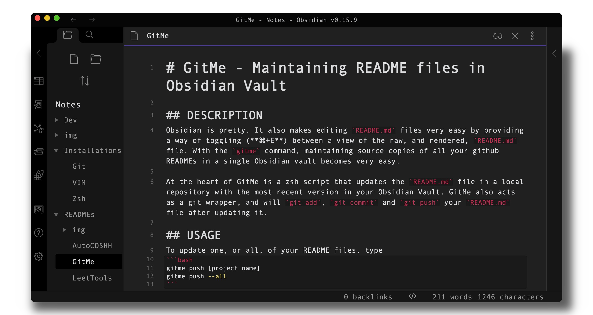

# GitMe - Maintaining README files in Obsidian Vault



## DESCRIPTION
Obsidian is pretty. It also makes editing `README.md` files very easy by providing a way to toggle (**⌘+E**) between a view of the raw markup, and the rendered `README.md` file. With the `gitme` command, maintaining source copies of all your github READMEs in a single Obsidian vault becomes very easy.

At the heart of GitMe is a shell script that updates the `README.md` file in the current directory with a file in your Obsidian Vault. Gitme also acts as a git wrapper, and will `git add`, `git commit` and `git push` your `README.md` file after updating it.

A different aspect of the shell script allows you to revert to previous versions of a README file by `git ` specifying how many commits back to revert to.

## USAGE
##### Update README edited in Obsidian
```bash
gitme update [name of obsidian file]
```

##### Revert back to most recent version of README
```bash
gitme revert [name of obsidian file]
```

##### Revert n commits back
```bash
gitme revert [name of obsidian file] n
```

###### NOTE -- MUST BE IN PROJECT DIRECTORY.

## FEATURES
* Easily edit README files, with preview functionality, in Obsidian.
* Update local README copy, then git add, commit, and push in one command.
* Revert back to most recent version of README.
* Update either one or all READMe files.

## INSTALLATION
1. Copy `gitme.zsh` script to `/usr/local/bin` or some other location in `$PATH`.
2. Change permissions to make executable: `sudo chmod +x gitme`.
3. Edit the script and change `path_obsidian='path/to/obsidian'` to the Obsidian Vault or folder containing your README files.
4. Create an alias in your shell configuration file to the `gitme.zsh` script.