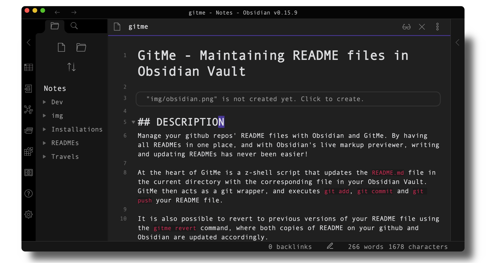

# Gitme - Maintaining README files in Obsidian Vault

## DESCRIPTION
Manage your github repos' README files with Obsidian and gitme. By having all READMEs in one place, and with Obsidian's live markup previewer, writing and updating READMEs has never been easier.

At the heart of gitme is a z shell script that updates the `README.md` file in the current directory with the corresponding file in your Obsidian Vault. gitme then acts as a git wrapper, and executes `git add`, `git commit` and `git push` on your README file.

It is also possible to revert to previous versions of your README file using the `gitme revert` command, where both copies of README on your github and Obsidian are updated accordingly.

## USAGE
### Update README edited in Obsidian
### `gitme update [name of obsidian file]`

### Revert back to most recent version of README
### `gitme revert [name of obsidian file]`

### Revert n commits back
### `gitme revert [name of obsidian file] n`

###### NOTE -- MUST BE IN PROJECT DIRECTORY.

## FEATURES
* Easily edit README files, with preview functionality, in Obsidian.
* Update local README copy, then git add, commit, and push in one command.
* Revert back to specific version of README.

## INSTALLATION
1. Create `~/.gitmerc` and add path to README folder in Obsidian.
2. Change permissions to make Zsh script executable - `sudo chmod +x gitme`.
3. Run and compile Zsh script, then remove `.zsh` extension.
4. Move `gitme` executable to `/usr/local/bin`/.
5. Add `/usr/local/bin/` to path.